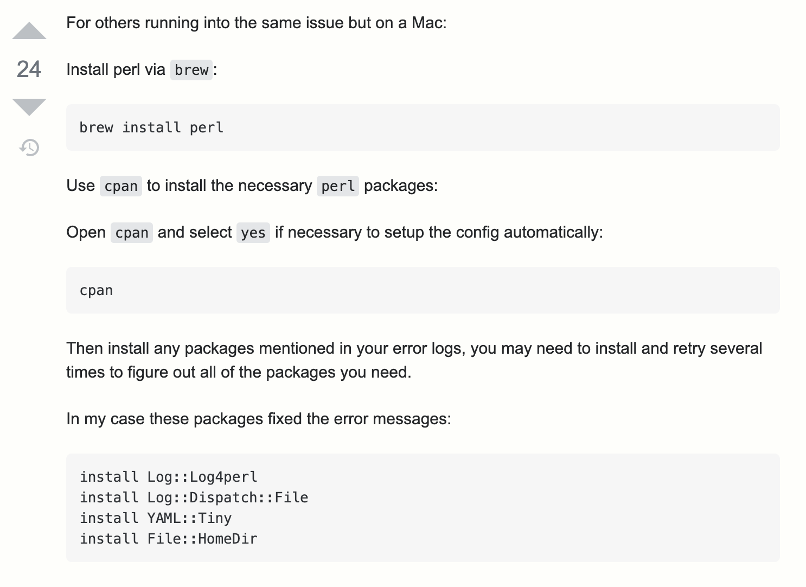

# How to setup Latex + latexindent.pl in VSCode

## VSCode

Install [VSCode](https://code.visualstudio.com/)

## VSCode plugin

Install [Latex-Workshop](https://marketplace.visualstudio.com/items?itemName=James-Yu.latex-workshop) plugin.

Or install plugin in the editor:


## Latex toolbox

[Tex](https://www.tug.org/texlive/) - Linux

[MacTeX](https://www.tug.org/mactex/) - MacOS

[MiKTeX](http://miktex.org/) - Windows

[Latex-Project](https://www.latex-project.org/get/) - Full info

## Latexindent.pl

[Source](https://www.ctan.org/pkg/latexindent)

For MacOS(check first link below): 


## VSCode settings
Add this line to your `settings.json` file:

`"latex-workshop.latexindent.path": "your_path"`

You can find your latexindent path using `which` command in the terminal:
```sh
which latexindent
```

For MacOS is `/Library/TeX/texbin/latexindent`

## Errors

If vscode outputs a message like: `Format failed...Chech logs... etc.` then you should check `latexindent.pl` packages manualy.
Just try to format your document with command line:

```sh
latexindent main.tex
```

In case you got an error like: 

"Can't locate `module_name` in @INC (you may need to install the `module_name` module" you should install missing packages(also check second link below).

Just open `cpan`

```sh
cpan
```

And install package:

```sh
install package_name
```



Then reload VSCode and try to save or build your document.

## Example

If you did everything right then try to indent this text:

```tex
\documentclass{article}

\begin{document}

\title{Introduction to \LaTeX{}}
\author{Author}

\maketitle

\begin{abstract}
  The abstract text goes here.
\end{abstract}

\section{Introduction}
 Here is the text of your introduction.

\begin{equation}
  \label{simple_equation}
  \alpha = \sqrt{ \beta }
\end{equation}

\subsection{Subsection Heading Here}
Write your subsection text here.

\section{Conclusion}
Write your conclusion here.

\end{document}
```

Result:


Indents should be corrected automatically.

_NOTE_: Preview hotkeys:

1) `Alt+Ctrl+V` - Linux or Windows
2) `Option+Cmd+V` - MacOS

## Links

1) [How to install latexindent.pl on MacOS](https://tex.stackexchange.com/questions/390433/how-can-i-install-latexindent-on-macos)
2) [Can't locate `module_name`](https://tex.stackexchange.com/questions/445521/latexindent-cant-locate-log-log4perl-pm-in-inc-you-may-need-to-install-the-l)


